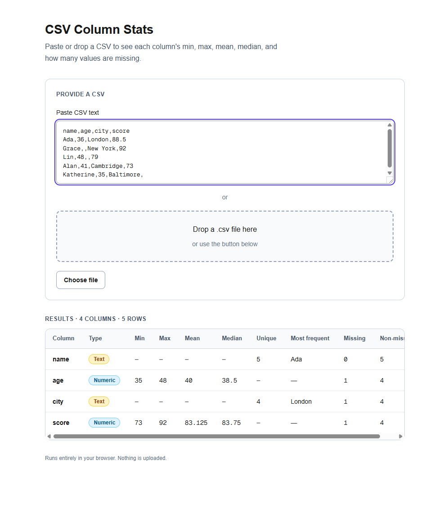

# csv-column-stats

Paste or drop a CSV and instantly see per-column statistics — no upload, no sign-in, all in your browser.

## What it does

Give it a CSV by pasting text, dropping a `.csv` file, or picking one with the file button. It parses the data locally and shows a table with one row per column:

- **Numeric columns** — min, max, mean, and median.
- **Text columns** — number of unique values and the most frequent one.
- **Every column** — how many values are missing (empty or whitespace) and how many are present.

Each column is labelled **Numeric** or **Text** so you can see at a glance how it was interpreted. Nothing is sent to a server — parsing and stats run entirely in the page.



## Getting started

```bash
bun install
bun run dev
```

Open http://localhost:3000 and paste a CSV.

## Commands

| Command | Does |
| --- | --- |
| `bun run dev` | dev server |
| `bun run build` | production build |
| `bun run lint` | Biome check |
| `bun run typecheck` | route typegen + tsc |
| `bun run test` | unit tests (Vitest) |
| `bun run test:e2e` | end-to-end tests (Playwright) |
| `bun run test:a11y` | accessibility scan (axe-core, WCAG 2.2 AA) |

## How it works

- `lib/parseCsv.ts` — wraps [Papa Parse](https://www.papaparse.com/) (`header: true`, `skipEmptyLines: "greedy"`), returning clean `Record<string, string>` rows plus any parse error.
- `lib/stats.ts` — pure functions that classify each column and compute its statistics. Fully unit-tested.
- `components/` — `CsvInput` (paste / drop / pick), `StatsTable`, and `TypeBadge`, one per file.
- `app/page.tsx` — wires input to stats and renders the empty, error, and results states.

## Testing

Unit tests live beside the code they cover (`lib/*.test.ts`). End-to-end and accessibility specs live in `e2e/`. Every route is scanned against WCAG 2.2 A + AA — add new routes to the `ROUTES` array in `e2e/a11y.spec.ts`, since an unlisted route is not covered.

## Tech stack

Bun, Next.js App Router, TypeScript strict, Tailwind CSS v4, Biome, Vitest, Playwright, Papa Parse.

## Deployment

Deployed on Vercel. Every pull request gets a preview build; production deploys are manual.
